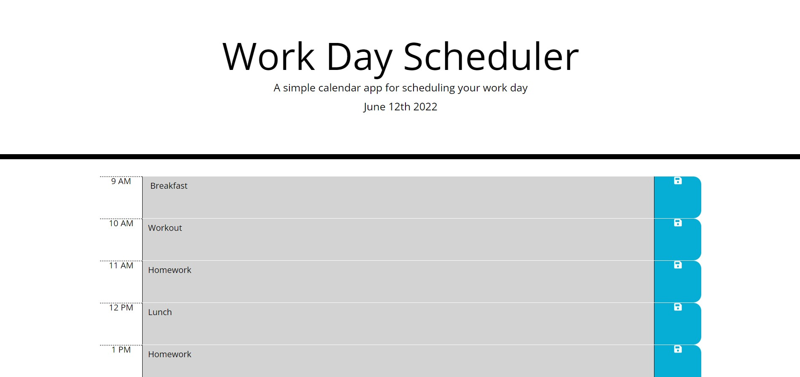
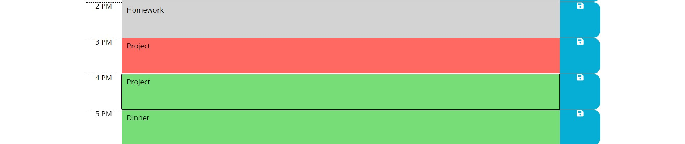

# Work Day Scheduler, Module-5-Challenge

    In this assignment I created a work day scheduler. 
    I used html, javascript and css to create this
    application. It all functions very well and 
    stores whatever data is entered in to the text
    boxes. Saved data can also be edited or replaced to
    adjust or change the schedule as well.

[Website](https://ianbridges.github.io/Module-5-Challenge/)

